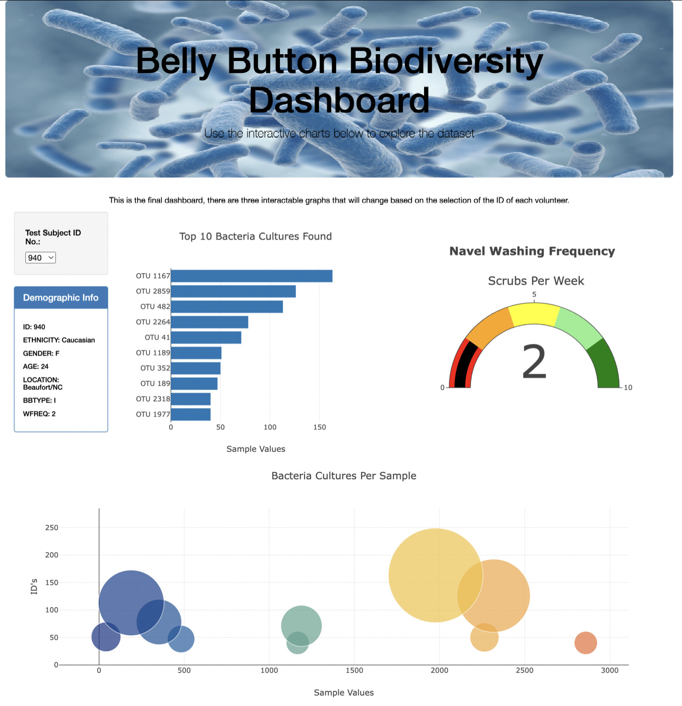
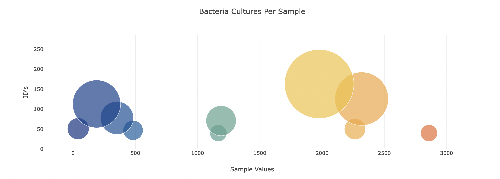

## Navel Biodiversity Dashboard

## **Overview of Project**

The purpose of this project was to complete a dahsboard for a researcher to view the demographic information and visualize bacterial data of each individual volunteer in the study. In particular, to be able to easily visualize and indentify the top 10 bacterial species in each individuals navel.

## Results

This is the final dashboard, there are four interactable data sets that will change based on the selection of the ID of each volunteer. 

## Resources

**Data Sources:** sample.json

**Software:** JavaScript, HTML, CSS
